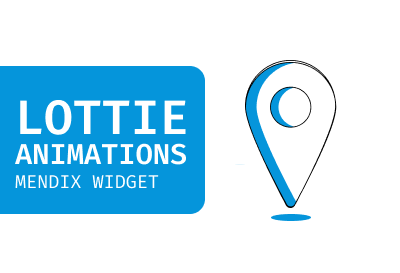
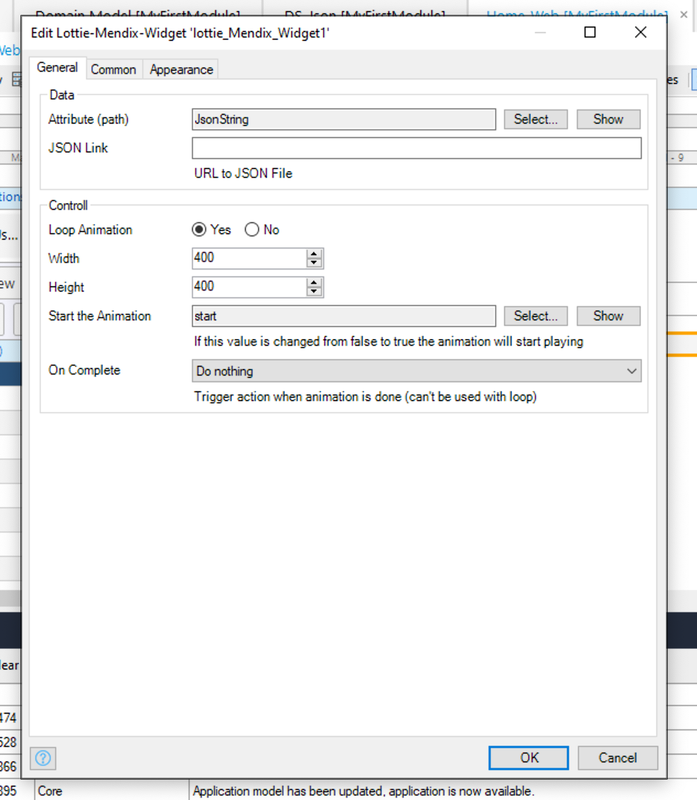
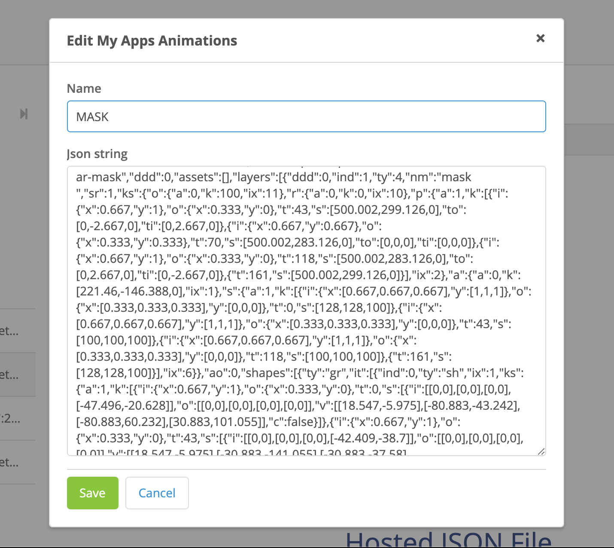

<h1 align="center">Lottie Animation For Mendix</h1>

  
  
  
  
  
   
  

 

   

    Lottie Implementation for Mendix.

    Lottie is any easy way to add beautifull animations to your app. It uses JSON files exported from After Effects.   Read more about Lottie 
      <a href="https://airbnb.design/lottie/">here</a> and see the possibilities  <a href="https://lottiefiles.com/">here</a>

<h2>Usage</h2>
 
 <h3>Data</h3>
 <h4>Usage with Hosted JSON Files</h4>
    

    In this option you dont have to store the Animation JSON file locally or copy it over, you can simply provide a publicly available URL.
    

 <h4>Usage with Attributes</h4>
    

    Here you will have to setup a entity in the domain model that stores the JSON in a String Attribute.
    

    

    You can simply open the JSON file in a Text Editor you receive from your designer and copy and save it.
    

**HERE is an example of a JSON string copied**

<h3>Controls</h3>

|                  | Type    | Info                                                                                                                     |
| ---------------- | ------- | ------------------------------------------------------------------------------------------------------------------------ |
| Loop             | boolean | Either loops the animation or not                                                                                        |
| Width and Height | number  | Set Animation Width and Height                                                                                           |
| Start Animation  | boolean | When this is selected the animation will only start once the value changes from False to True _(Non persistable object)_ |
| On Complete      | action  | When this is selected it will trigger the action once the animation is Done (WILL NOT TRIGGER ON LOOPING ANIMATIONS)     |

## Example GIF

**Example of a Microflow triggering a Manual Start**

**Example of a OnComplete triggering a Page To Open (Also A Manual Start)**

**Random Locally Stored Animations** 

## Known Issues

-   Currently not able to loop segments and then stop the Animation

## Issues, suggestions and feature requests

[Github Issues](https://github.com/ahwelgemoed/lottie-mendix-widget/issues "Github Issues")

## Development and contribution

[specify contribute]
